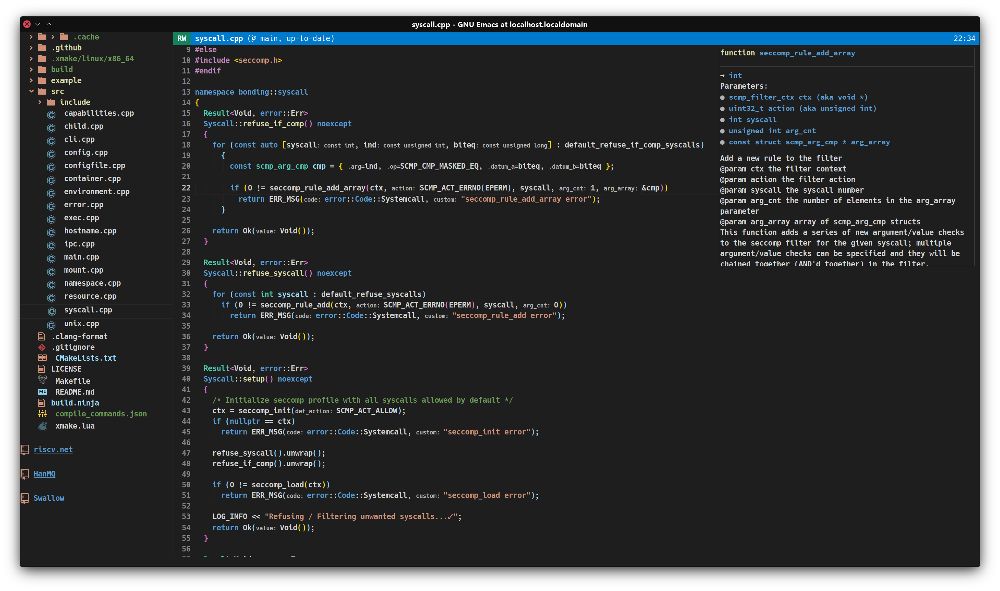
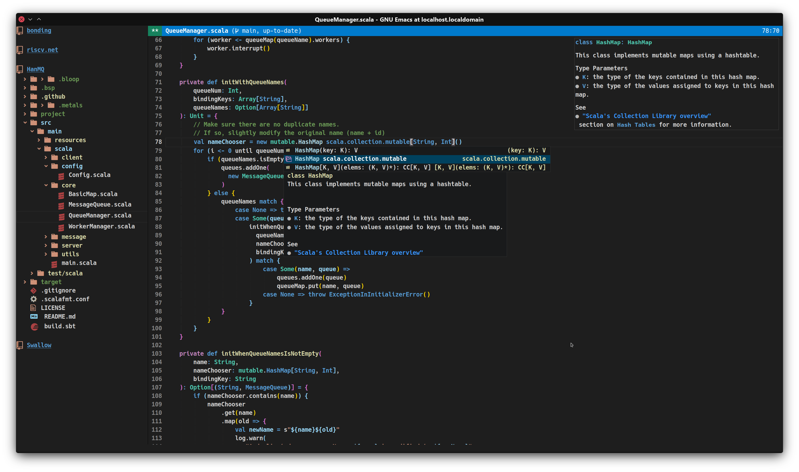

<div align="center">

# MuqiuHan's .emacs.d

*A minimalism, lightweight, fast configuration for GNU/Emacs*





</div>

## RECOMMEND BUILD CONFIGURE
> If you are very familiar with configure options or know exactly what kind of Emacs you need to build, then feel free to :)

- Emacs 29.1 and later: ``./configure --with-all --with-treesitter``
- Other" ``./configure --with-all``

## PROGRAMMING LANGUAGE SUPPORTED
> eglot hook to prog-mode

- C/C++: eglot + clangd
- OCaml: tuareg + merlin + ocamlformat + utop
- Scala: eglot + metals
- Rust: eglot + rustic
- Racket: racket-mode + racket-xp-mode
- Coq: Proof-General
- Agda: agda2-mode
- Clojure: cider-mode

### About OCaml environment
The OCaml environment depends on `opam-user-setup.el`, which is generated to `.emacs.d` through `opam user-setup install`. 
If the `(setq-default ocaml-environment t)`, you need to execute this command first, and then remove the `(load "opam-user-setup.el")` at the end of `init.el`.

## CUSTOMIZE
```elisp
(setq-default ocaml-environment t)
(setq-default c++-environment t)
(setq-default fsharp-environment t)
(setq-default racket-environment t)
(setq-default scala-environment t)
(setq-default rust-environment t)
(setq-default clojure-environment nil)
(setq-default agda-environment nil)
(setq-default evil nil)
(setq-default coq-environment nil)
(setq-default backup-directory-alist `(("." . "~/.saves")))
(setq-default gc-cons-threshold (* 50 1000 1000))
(setq-default line-spacing 0.2)
(setq-default cursor-type 'bar)
(setq-default font "Ricty Diminished Discord")
(setq-default font-weight 'bold)
(setq-default font-size 115)
(setq-default font-ligature nil)
(setq-default minimap nil)
(setq-default chinese-font "Microsoft YaHei UI")
(setq-default chinese-font-weight 'bold)
(setq-default chinese-font-size 31)
(setq-default light-theme 'modus-operandi)
(setq-default dark-theme 'modus-vivendi)
(setq-default is-graphics (display-graphic-p))
(setq-default is-x11 (string-equal "x11" (getenv "XDG_SESSION_TYPE")))
(setq-default package-archives '(("gnu"    . "http://mirrors.tuna.tsinghua.edu.cn/elpa/gnu/")
				 ("nongnu" . "http://mirrors.tuna.tsinghua.edu.cn/elpa/nongnu/")
				 ("melpa"  . "http://mirrors.tuna.tsinghua.edu.cn/elpa/melpa/")))
(setq-default url-proxy-services
              '(("no_proxy" . "^\\(localhost\\|10.*\\)")
                ("http" . "127.0.0.1:7890")
                ("https" . "127.0.0.1:7890")))
```


## KEY BINDING
> This configuration uses Emacs native keys

- Vterm: `[F9]`
- Translator: `C-c y`
- Treemacs: `C-x t t`

# LICENSE
Copyright (C) 2022 Muqiu Han <muqiu-han@outlook.com>

This program is free software: you can redistribute it and/or modify
it under the terms of the GNU General Public License as published by
the Free Software Foundation, either version 3 of the License, or
(at your option) any later version.

This program is distributed in the hope that it will be useful,
but WITHOUT ANY WARRANTY; without even the implied warranty of
MERCHANTABILITY or FITNESS FOR A PARTICULAR PURPOSE.  See the
GNU General Public License for more details.

You should have received a copy of the GNU General Public License
along with this program.  If not, see <http://www.gnu.org/licenses/>.
