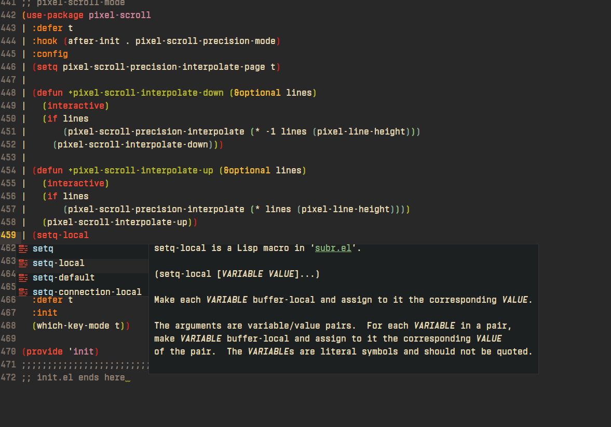
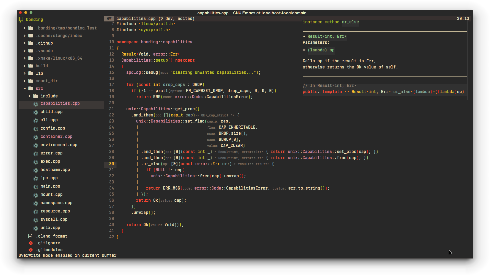

<div align="center">

# MuqiuHan's .emacs.d

*A simple, lightweight, fast configuration for GNU/Emacs*

__[29.1 Support]__ | __[Terminal Suport]__ | __[lsp support]__




</div>

## RECOMMEND BUILD CONFIGURE
> If you are very familiar with configure options or know exactly what kind of Emacs you need to build, then feel free to :)

- Emacs 29.1 and later: ``./configure --with-all --with-treesitter``
- Other" ``./configure --with-all``

## CONFIGURATION
```elisp
(setq-default ocaml-environment t)
(setq-default racket-environment t)
(setq-default clojure-environment t)
(setq-default agda-environment t)
(setq-default coq-environment t)
(setq-default backup-directory-alist `(("." . "~/.saves")))
(setq-default gc-cons-threshold (* 50 1000 1000))
(setq-default line-spacing 0.7)
(setq-default cursor-type 'hbar)
(setq-default font "Vin Mono Pro ExtraBold")
(setq-default font-weight 'extrabold)
(setq-default font-size 17)
(setq-default chinese-font "TsangerMingHei")
(setq-default chinese-font-weight 'bold)
(setq-default chinese-font-size 17)
(setq-default url-proxy-services
	      '(("no_proxy" . "^\\(localhost\\|10.*\\)")
		("http" . "127.0.0.1:7890")
		("https" . "127.0.0.1:7890")))
(setq-default theme 'doom-gruvbox)
(setq-default is-graphics (display-graphic-p))
(setq-default is-x11 (string-equal "x11" (getenv "XDG_SESSION_TYPE")))
(setq-default package-archives '(("gnu"    . "http://mirrors.tuna.tsinghua.edu.cn/elpa/gnu/")
				 ("nongnu" . "http://mirrors.tuna.tsinghua.edu.cn/elpa/nongnu/")
				 ("melpa"  . "http://mirrors.tuna.tsinghua.edu.cn/elpa/melpa/")))
```

## PROGRAMMING LANGUAGE ENVIRONMEN
> Eglot will try to start in every prog-mode

- Native support for C/C++ (eglot + clangd)
- OCaml: tuareg + merlin + ocamlformat + utop
- Racket: racket-mode + racket-xp-mode
- Coq: Proof-General
- Agda: agda2-mode
- Clojure: cider-mode

## Key Binding
> This configuration uses Emacs native keys

- Vterm: `[F9]`
- Translate: `C-c y`
- Treemacs: `C-x t t`

# LICENSE
  Copyright (C) 2022 Muqiu Han <muqiu-han@outlook.com>

  This program is free software: you can redistribute it and/or modify
  it under the terms of the GNU General Public License as published by
  the Free Software Foundation, either version 3 of the License, or
  (at your option) any later version.

  This program is distributed in the hope that it will be useful,
  but WITHOUT ANY WARRANTY; without even the implied warranty of
  MERCHANTABILITY or FITNESS FOR A PARTICULAR PURPOSE.  See the
  GNU General Public License for more details.

  You should have received a copy of the GNU General Public License
  along with this program.  If not, see <http://www.gnu.org/licenses/>.
